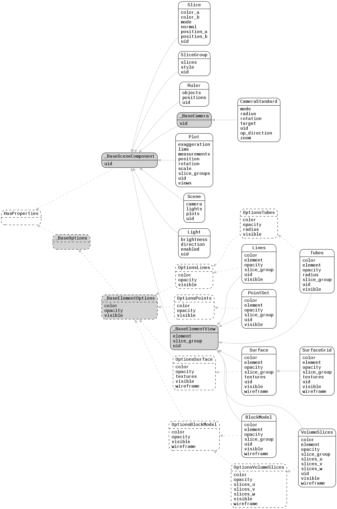

.. _lfview_resources_scene_scene:

Scene Resources
************************************************************************
Components required to construct a 3D scene with views of Element

Doc links:
:class:`_BaseCamera <lfview.resources.scene.scene._BaseCamera>`
:class:`_BaseElementOptions <lfview.resources.spatial.options._BaseElementOptions>`
:class:`_BaseElementView <lfview.resources.scene.scene._BaseElementView>`
:class:`_BaseOptions <lfview.resources.spatial.options._BaseOptions>`
:class:`_BaseSceneComponent <lfview.resources.scene.scene._BaseSceneComponent>`
:class:`BlockModel <lfview.resources.scene.scene.BlockModel>`
:class:`CameraStandard <lfview.resources.scene.scene.CameraStandard>`
:class:`HasProperties <properties.HasProperties>`
:class:`Light <lfview.resources.scene.scene.Light>`
:class:`Lines <lfview.resources.scene.scene.Lines>`
:class:`OptionsBlockModel <lfview.resources.spatial.options.OptionsBlockModel>`
:class:`OptionsLines <lfview.resources.spatial.options.OptionsLines>`
:class:`OptionsPoints <lfview.resources.spatial.options.OptionsPoints>`
:class:`OptionsSurface <lfview.resources.spatial.options.OptionsSurface>`
:class:`OptionsTubes <lfview.resources.spatial.options.OptionsTubes>`
:class:`OptionsVolumeSlices <lfview.resources.spatial.options.OptionsVolumeSlices>`
:class:`Plot <lfview.resources.scene.scene.Plot>`
:class:`PointSet <lfview.resources.scene.scene.PointSet>`
:class:`Ruler <lfview.resources.scene.scene.Ruler>`
:class:`Scene <lfview.resources.scene.scene.Scene>`
:class:`Slice <lfview.resources.scene.scene.Slice>`
:class:`SliceGroup <lfview.resources.scene.scene.SliceGroup>`
:class:`Surface <lfview.resources.scene.scene.Surface>`
:class:`SurfaceGrid <lfview.resources.scene.scene.SurfaceGrid>`
:class:`Tubes <lfview.resources.scene.scene.Tubes>`
:class:`VolumeSlices <lfview.resources.scene.scene.VolumeSlices>`

.. autoclass:: lfview.resources.scene.scene._BaseSceneComponent

.. autoclass:: lfview.resources.scene.scene.Light

.. autoclass:: lfview.resources.scene.scene.Slice

.. autoclass:: lfview.resources.scene.scene.SliceGroup

.. autoclass:: lfview.resources.scene.scene.Ruler

.. autoclass:: lfview.resources.scene.scene._BaseCamera

.. autoclass:: lfview.resources.scene.scene.CameraStandard

.. autoclass:: lfview.resources.scene.scene._BaseElementView

.. autoclass:: lfview.resources.scene.scene.PointSet

.. autoclass:: lfview.resources.scene.scene.Lines

.. autoclass:: lfview.resources.scene.scene.Tubes

.. autoclass:: lfview.resources.scene.scene.Surface

.. autoclass:: lfview.resources.scene.scene.SurfaceGrid

.. autoclass:: lfview.resources.scene.scene.BlockModel

.. autoclass:: lfview.resources.scene.scene.VolumeSlices

.. autoclass:: lfview.resources.scene.scene.Plot

.. autoclass:: lfview.resources.scene.scene.Scene

