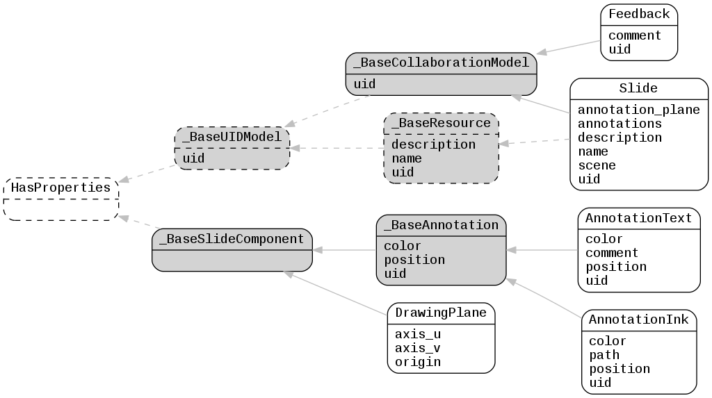

.. _lfview_resources_scene_slide:

Slide Resources
************************************************************************
Slide object holding scene info and annotations

Doc links:
:class:`_BaseAnnotation <lfview.resources.scene.slide._BaseAnnotation>`
:class:`_BaseCollaborationModel <lfview.resources.scene.slide._BaseCollaborationModel>`
:class:`_BaseResource <lfview.resources.spatial.base._BaseResource>`
:class:`_BaseSlideComponent <lfview.resources.scene.slide._BaseSlideComponent>`
:class:`_BaseUIDModel <lfview.resources.files.base._BaseUIDModel>`
:class:`AnnotationInk <lfview.resources.scene.slide.AnnotationInk>`
:class:`AnnotationText <lfview.resources.scene.slide.AnnotationText>`
:class:`DrawingPlane <lfview.resources.scene.slide.DrawingPlane>`
:class:`Feedback <lfview.resources.scene.slide.Feedback>`
:class:`HasProperties <properties.HasProperties>`
:class:`Slide <lfview.resources.scene.slide.Slide>`

.. autoclass:: lfview.resources.scene.slide._BaseSlideComponent

.. autoclass:: lfview.resources.scene.slide._BaseAnnotation

.. autoclass:: lfview.resources.scene.slide.AnnotationText

.. autoclass:: lfview.resources.scene.slide.AnnotationInk

.. autoclass:: lfview.resources.scene.slide.DrawingPlane

.. autoclass:: lfview.resources.scene.slide._BaseCollaborationModel

.. autoclass:: lfview.resources.scene.slide.Slide

.. autoclass:: lfview.resources.scene.slide.Feedback

